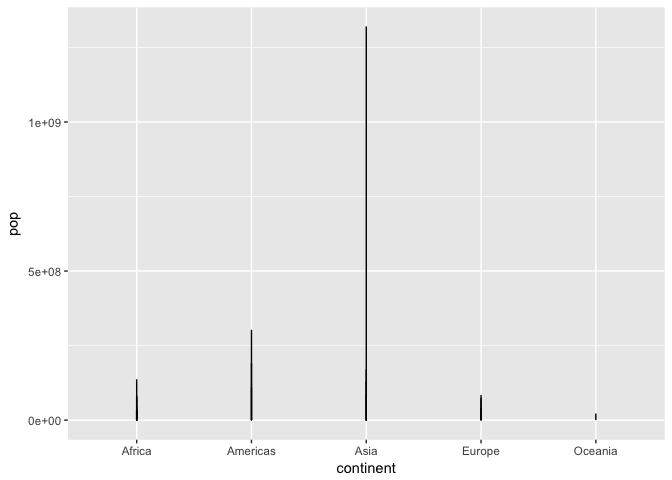
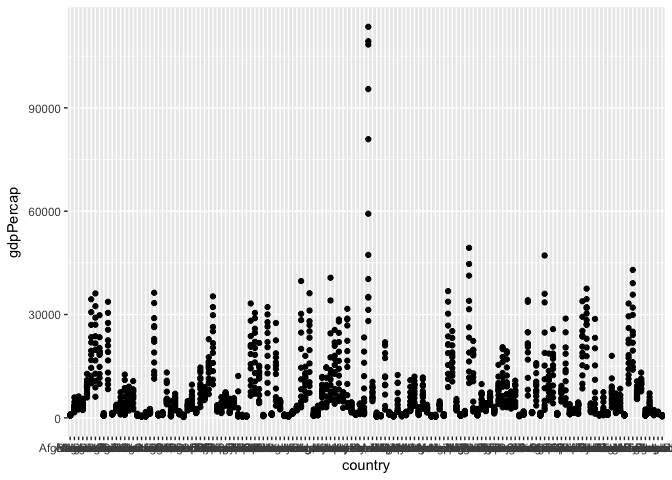
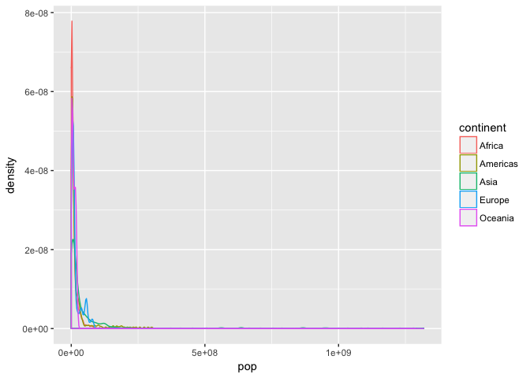
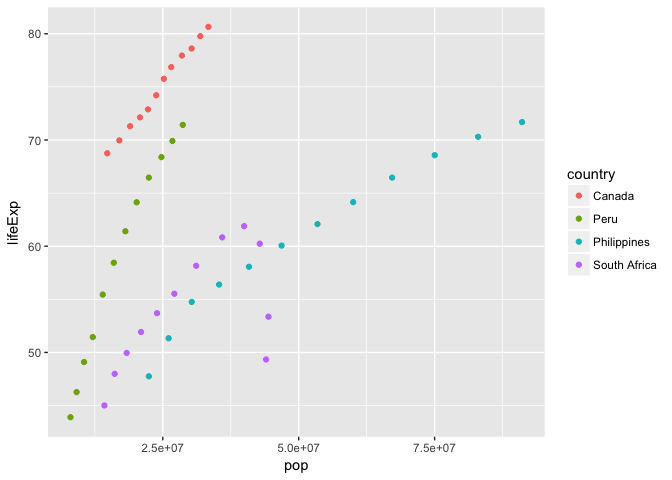
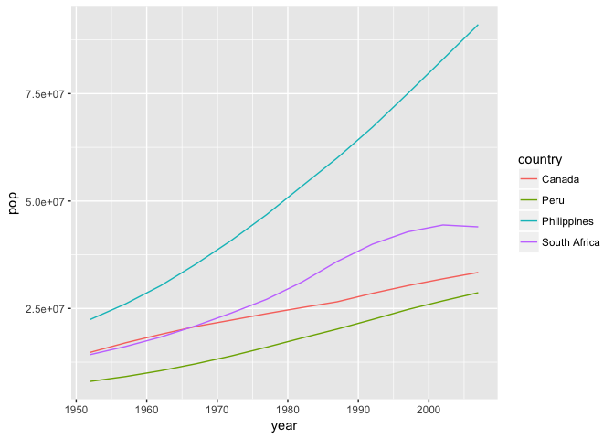
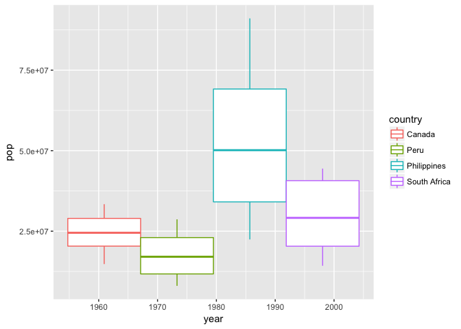

Homework 02 ReadMe
================

Doing Homework 02
=================

Installing gapminder and tidyverse.
-----------------------------------

``` r
library(gapminder)
```

``` r
library(tidyverse)
```

    ## Warning: package 'tidyverse' was built under R version 3.3.2

    ## Loading tidyverse: ggplot2
    ## Loading tidyverse: tibble
    ## Loading tidyverse: tidyr
    ## Loading tidyverse: readr
    ## Loading tidyverse: purrr
    ## Loading tidyverse: dplyr

    ## Warning: package 'ggplot2' was built under R version 3.3.2

    ## Warning: package 'tibble' was built under R version 3.3.2

    ## Warning: package 'tidyr' was built under R version 3.3.2

    ## Warning: package 'readr' was built under R version 3.3.2

    ## Warning: package 'purrr' was built under R version 3.3.2

    ## Warning: package 'dplyr' was built under R version 3.3.2

    ## Conflicts with tidy packages ----------------------------------------------

    ## filter(): dplyr, stats
    ## lag():    dplyr, stats

(A) Exploring attributes of gapminder
-------------------------------------

### (1) Type of Gapminder

``` r
typeof(gapminder)
```

    ## [1] "list"

### (2) Class of Gapminder

``` r
class(gapminder)
```

    ## [1] "tbl_df"     "tbl"        "data.frame"

### (3) Variables / Columns

``` r
ncol(gapminder)
```

    ## [1] 6

### (4) Rows / Observations

``` r
nrow(gapminder)
```

    ## [1] 1704

### (5) Alternative ways of determining "size" or "extent"

``` r
dim(gapminder)
```

    ## [1] 1704    6

``` r
summary(gapminder)
```

    ##         country        continent        year         lifeExp     
    ##  Afghanistan:  12   Africa  :624   Min.   :1952   Min.   :23.60  
    ##  Albania    :  12   Americas:300   1st Qu.:1966   1st Qu.:48.20  
    ##  Algeria    :  12   Asia    :396   Median :1980   Median :60.71  
    ##  Angola     :  12   Europe  :360   Mean   :1980   Mean   :59.47  
    ##  Argentina  :  12   Oceania : 24   3rd Qu.:1993   3rd Qu.:70.85  
    ##  Australia  :  12                  Max.   :2007   Max.   :82.60  
    ##  (Other)    :1632                                                
    ##       pop              gdpPercap       
    ##  Min.   :6.001e+04   Min.   :   241.2  
    ##  1st Qu.:2.794e+06   1st Qu.:  1202.1  
    ##  Median :7.024e+06   Median :  3531.8  
    ##  Mean   :2.960e+07   Mean   :  7215.3  
    ##  3rd Qu.:1.959e+07   3rd Qu.:  9325.5  
    ##  Max.   :1.319e+09   Max.   :113523.1  
    ## 

### (6) Type of each variable?

``` r
sapply(gapminder, typeof)
```

    ##   country continent      year   lifeExp       pop gdpPercap 
    ## "integer" "integer" "integer"  "double" "integer"  "double"

#### Reflections of the Process

-   This section took me awhile since I have forgotten almost all of these functions and had to go back to the notes. As you might have guessed, I am new at R.
-   I also consulted google a lot. My seatmate, Cindy, who was the one of the peer reviewers of my first homework assignment, also helped a lot. Shoutout to Cindy! I also learned from the two classmates whose first homework I reviewed.
-   My first homework was done haphazardly. I will eventually edit the main ReadMe file. I hope this homework is easier to follow for the reviewers and markers.

! <https://en.wikipedia.org/wiki/Keep_Calm_and_Carry_On#/media/File:Keep-calm-and-carry-on-scan.jpg>

(B) Exploring individual variables of gapminder
-----------------------------------------------

### (1) Possible values (or range, whichever is appropriate) of each variable?

``` r
max <- sapply(select(gapminder,year,lifeExp,pop,gdpPercap),max)
min <- sapply(select(gapminder,year,lifeExp,pop,gdpPercap),min)
#Range of Years
c(min[1],max[1])
```

    ## year year 
    ## 1952 2007

``` r
#Range of lifeExp
c(min[1],max[1])
```

    ## year year 
    ## 1952 2007

``` r
#Range of pop
c(min[1],max[1])
```

    ## year year 
    ## 1952 2007

``` r
#Range of gdpPercap
c(min[1],max[1])
```

    ## year year 
    ## 1952 2007

``` r

```

    ## year year 
    ## 2007 1952

``` r
#Range of LifeExp
c(max[2],min[2])
```

    ## lifeExp lifeExp 
    ##  82.603  23.599

``` r
#Range of Pop
c(max[3],min[3])
```

    ##        pop        pop 
    ## 1318683096      60011

``` r
#Range of gdpPercap
c(max[4],min[4])
```

    ##   gdpPercap   gdpPercap 
    ## 113523.1329    241.1659

``` r
table(gapminder$country)
```

    ## 
    ##              Afghanistan                  Albania                  Algeria 
    ##                       12                       12                       12 
    ##                   Angola                Argentina                Australia 
    ##                       12                       12                       12 
    ##                  Austria                  Bahrain               Bangladesh 
    ##                       12                       12                       12 
    ##                  Belgium                    Benin                  Bolivia 
    ##                       12                       12                       12 
    ##   Bosnia and Herzegovina                 Botswana                   Brazil 
    ##                       12                       12                       12 
    ##                 Bulgaria             Burkina Faso                  Burundi 
    ##                       12                       12                       12 
    ##                 Cambodia                 Cameroon                   Canada 
    ##                       12                       12                       12 
    ## Central African Republic                     Chad                    Chile 
    ##                       12                       12                       12 
    ##                    China                 Colombia                  Comoros 
    ##                       12                       12                       12 
    ##         Congo, Dem. Rep.              Congo, Rep.               Costa Rica 
    ##                       12                       12                       12 
    ##            Cote d'Ivoire                  Croatia                     Cuba 
    ##                       12                       12                       12 
    ##           Czech Republic                  Denmark                 Djibouti 
    ##                       12                       12                       12 
    ##       Dominican Republic                  Ecuador                    Egypt 
    ##                       12                       12                       12 
    ##              El Salvador        Equatorial Guinea                  Eritrea 
    ##                       12                       12                       12 
    ##                 Ethiopia                  Finland                   France 
    ##                       12                       12                       12 
    ##                    Gabon                   Gambia                  Germany 
    ##                       12                       12                       12 
    ##                    Ghana                   Greece                Guatemala 
    ##                       12                       12                       12 
    ##                   Guinea            Guinea-Bissau                    Haiti 
    ##                       12                       12                       12 
    ##                 Honduras         Hong Kong, China                  Hungary 
    ##                       12                       12                       12 
    ##                  Iceland                    India                Indonesia 
    ##                       12                       12                       12 
    ##                     Iran                     Iraq                  Ireland 
    ##                       12                       12                       12 
    ##                   Israel                    Italy                  Jamaica 
    ##                       12                       12                       12 
    ##                    Japan                   Jordan                    Kenya 
    ##                       12                       12                       12 
    ##         Korea, Dem. Rep.              Korea, Rep.                   Kuwait 
    ##                       12                       12                       12 
    ##                  Lebanon                  Lesotho                  Liberia 
    ##                       12                       12                       12 
    ##                    Libya               Madagascar                   Malawi 
    ##                       12                       12                       12 
    ##                 Malaysia                     Mali               Mauritania 
    ##                       12                       12                       12 
    ##                Mauritius                   Mexico                 Mongolia 
    ##                       12                       12                       12 
    ##               Montenegro                  Morocco               Mozambique 
    ##                       12                       12                       12 
    ##                  Myanmar                  Namibia                    Nepal 
    ##                       12                       12                       12 
    ##              Netherlands              New Zealand                Nicaragua 
    ##                       12                       12                       12 
    ##                    Niger                  Nigeria                   Norway 
    ##                       12                       12                       12 
    ##                     Oman                 Pakistan                   Panama 
    ##                       12                       12                       12 
    ##                 Paraguay                     Peru              Philippines 
    ##                       12                       12                       12 
    ##                   Poland                 Portugal              Puerto Rico 
    ##                       12                       12                       12 
    ##                  Reunion                  Romania                   Rwanda 
    ##                       12                       12                       12 
    ##    Sao Tome and Principe             Saudi Arabia                  Senegal 
    ##                       12                       12                       12 
    ##                   Serbia             Sierra Leone                Singapore 
    ##                       12                       12                       12 
    ##          Slovak Republic                 Slovenia                  Somalia 
    ##                       12                       12                       12 
    ##             South Africa                    Spain                Sri Lanka 
    ##                       12                       12                       12 
    ##                    Sudan                Swaziland                   Sweden 
    ##                       12                       12                       12 
    ##              Switzerland                    Syria                   Taiwan 
    ##                       12                       12                       12 
    ##                 Tanzania                 Thailand                     Togo 
    ##                       12                       12                       12 
    ##      Trinidad and Tobago                  Tunisia                   Turkey 
    ##                       12                       12                       12 
    ##                   Uganda           United Kingdom            United States 
    ##                       12                       12                       12 
    ##                  Uruguay                Venezuela                  Vietnam 
    ##                       12                       12                       12 
    ##       West Bank and Gaza              Yemen, Rep.                   Zambia 
    ##                       12                       12                       12 
    ##                 Zimbabwe 
    ##                       12

``` r
table(gapminder$continent)
```

    ## 
    ##   Africa Americas     Asia   Europe  Oceania 
    ##      624      300      396      360       24

### (2) Typical values: spread and distribution

``` r
HW02Plot1 <- ggplot(gapminder, aes(x=continent, y=pop)) + geom_line()
HW02Plot1
```



``` r
HW02Plot2 <- ggplot(gapminder, aes(x=country, y=gdpPercap)) + geom_point()
HW02Plot2
```



``` r
HW02Plot3 <- ggplot(gapminder, aes(x=pop, color=continent)) + 
  geom_density()
HW02Plot3
```



#### Reflections on the process

-   This is fun. I could do more of this. I am itching to work on my data now and produce these visualizations.

(C) Exploring various plot types
--------------------------------

### (1) Scatterplot of two quantitative variables

``` r
gapminder %>%
  filter (country %in% c("Philippines", "Canada","South Africa","Peru")) %>% 
  ggplot(aes(x = pop, y = lifeExp)) +
  geom_point(aes(color = country))
```

    ## Warning: package 'bindrcpp' was built under R version 3.3.2



### (2) A plot of one quantitative variable

``` r
gapminder %>%
  filter (country %in% c("Philippines", "Canada","South Africa","Peru")) %>% 
  ggplot(aes(x = year, y = pop)) +
  geom_line(aes(color = country))
```



### (3) A plot of one quantitative variable and one categorical variable.

``` r
gapminder %>%
  filter (country %in% c("Philippines", "Canada","South Africa","Peru")) %>% 
  ggplot(aes(x = year, y = pop, color = country)) +
  geom_boxplot(aes(shape = country))
```



### (4) Using select and filter and piping

``` r
select(gapminder, country, continent)
```

    ## # A tibble: 1,704 x 2
    ##        country continent
    ##         <fctr>    <fctr>
    ##  1 Afghanistan      Asia
    ##  2 Afghanistan      Asia
    ##  3 Afghanistan      Asia
    ##  4 Afghanistan      Asia
    ##  5 Afghanistan      Asia
    ##  6 Afghanistan      Asia
    ##  7 Afghanistan      Asia
    ##  8 Afghanistan      Asia
    ##  9 Afghanistan      Asia
    ## 10 Afghanistan      Asia
    ## # ... with 1,694 more rows

``` r
filter(gapminder, 
       continent != "Asia")
```

    ## # A tibble: 1,308 x 6
    ##    country continent  year lifeExp     pop gdpPercap
    ##     <fctr>    <fctr> <int>   <dbl>   <int>     <dbl>
    ##  1 Albania    Europe  1952  55.230 1282697  1601.056
    ##  2 Albania    Europe  1957  59.280 1476505  1942.284
    ##  3 Albania    Europe  1962  64.820 1728137  2312.889
    ##  4 Albania    Europe  1967  66.220 1984060  2760.197
    ##  5 Albania    Europe  1972  67.690 2263554  3313.422
    ##  6 Albania    Europe  1977  68.930 2509048  3533.004
    ##  7 Albania    Europe  1982  70.420 2780097  3630.881
    ##  8 Albania    Europe  1987  72.000 3075321  3738.933
    ##  9 Albania    Europe  1992  71.581 3326498  2497.438
    ## 10 Albania    Europe  1997  72.950 3428038  3193.055
    ## # ... with 1,298 more rows

``` r
gapminder %>% 
  filter (country %in% c("Philippines", "Peru"),
          year<= 1969, year >= 1960) %>%
  select (country, year, pop)
```

    ## # A tibble: 4 x 3
    ##       country  year      pop
    ##        <fctr> <int>    <int>
    ## 1        Peru  1962 10516500
    ## 2        Peru  1967 12132200
    ## 3 Philippines  1962 30325264
    ## 4 Philippines  1967 35356600

#### Reflections of the Process

-   I want to explore more but I don't have time. This has been a very useful homework.
-   I am having difficulties pushing this back to GitHub.
