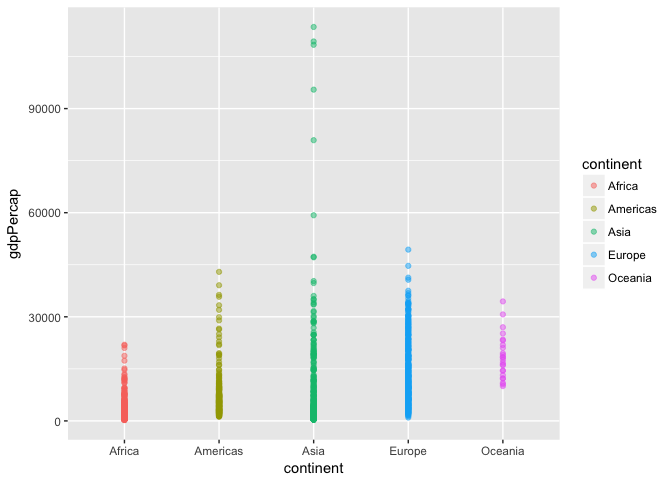

Hw\_03
================

Doing Homework 03 and Reflecting on the Process
===============================================

Loading the libraries

``` r
library(gapminder)
library(tidyverse)
```

    ## Warning: package 'tidyverse' was built under R version 3.3.2

    ## Loading tidyverse: ggplot2
    ## Loading tidyverse: tibble
    ## Loading tidyverse: tidyr
    ## Loading tidyverse: readr
    ## Loading tidyverse: purrr
    ## Loading tidyverse: dplyr

    ## Warning: package 'ggplot2' was built under R version 3.3.2

    ## Warning: package 'tibble' was built under R version 3.3.2

    ## Warning: package 'tidyr' was built under R version 3.3.2

    ## Warning: package 'readr' was built under R version 3.3.2

    ## Warning: package 'purrr' was built under R version 3.3.2

    ## Warning: package 'dplyr' was built under R version 3.3.2

    ## Conflicts with tidy packages ----------------------------------------------

    ## filter(): dplyr, stats
    ## lag():    dplyr, stats

Task One:
---------

Get the maximum and minimum of GDP per capita for all continents

``` r
max_gdpPercap <- gapminder %>% 
  group_by(continent) %>% 
  summarize(maximum = max(gdpPercap))
max_gdpPercap
```

    ## # A tibble: 5 x 2
    ##   continent   maximum
    ##      <fctr>     <dbl>
    ## 1    Africa  21951.21
    ## 2  Americas  42951.65
    ## 3      Asia 113523.13
    ## 4    Europe  49357.19
    ## 5   Oceania  34435.37

### Note 1:

I reworked a code from cm008 notes.

``` r
table(max_gdpPercap)
```

    ##           maximum
    ## continent  21951.21176 34435.36744 42951.65309 49357.19017 113523.1329
    ##   Africa             1           0           0           0           0
    ##   Americas           0           0           1           0           0
    ##   Asia               0           0           0           0           1
    ##   Europe             0           0           0           1           0
    ##   Oceania            0           1           0           0           0

### Note 2:

I don't remember this function-- table-- being discussed in class. So I looked up a code on google. After a few tries, I think I have managed to do a table.

``` r
knitr::kable(max_gdpPercap)
```

| continent      |                                                                maximum|
|:---------------|----------------------------------------------------------------------:|
| Africa         |                                                               21951.21|
| Americas       |                                                               42951.65|
| Asia           |                                                              113523.13|
| Europe         |                                                               49357.19|
| Oceania        |                                                               34435.37|
| \#\#\# Note 3: |                                                                       |
| I used the c   |  ode suggested in the hw03 page substituting my\_df to max\_gdpPercap.|

``` r
plot1 <- ggplot(max_gdpPercap, aes(x=continent, y=maximum)) + geom_point()
plot1
```

 \#\#\# Note 4: I used geom\_point to visualize the difference between max\_gdpPercap among continents.

``` r
min_gdpPercap <- gapminder %>% 
  group_by(continent) %>% 
  summarize(minimum = min(gdpPercap))
min_gdpPercap
```

    ## # A tibble: 5 x 2
    ##   continent    minimum
    ##      <fctr>      <dbl>
    ## 1    Africa   241.1659
    ## 2  Americas  1201.6372
    ## 3      Asia   331.0000
    ## 4    Europe   973.5332
    ## 5   Oceania 10039.5956

``` r
table(min_gdpPercap)
```

    ##           minimum
    ## continent  241.1658765 331 973.5331948 1201.637154 10039.59564
    ##   Africa             1   0           0           0           0
    ##   Americas           0   0           0           1           0
    ##   Asia               0   1           0           0           0
    ##   Europe             0   0           1           0           0
    ##   Oceania            0   0           0           0           1

``` r
knitr::kable(min_gdpPercap)
```

| continent |     minimum|
|:----------|-----------:|
| Africa    |    241.1659|
| Americas  |   1201.6372|
| Asia      |    331.0000|
| Europe    |    973.5332|
| Oceania   |  10039.5956|

``` r
miniplot <- ggplot(min_gdpPercap,aes(x=continent,y=minimum)) + geom_point()
miniplot
```

 \#\#\# Note 5: For the min\_gdpPercap, I copied the codes I used above, changed max to min, and laid out all the codes in one chunk.

Task Two:
---------

Look at the spread of GDP per capita within the continents.

``` r
spread <- gapminder %>%
  group_by(continent,country) %>%
  summarize(gdp_avg=mean(gdpPercap))
spread <- arrange(spread, continent)
```

    ## Warning: package 'bindrcpp' was built under R version 3.3.2

``` r
knitr::kable(spread)
```

| continent | country                  |    gdp\_avg|
|:----------|:-------------------------|-----------:|
| Africa    | Algeria                  |   4426.0260|
| Africa    | Angola                   |   3607.1005|
| Africa    | Benin                    |   1155.3951|
| Africa    | Botswana                 |   5031.5036|
| Africa    | Burkina Faso             |    843.9907|
| Africa    | Burundi                  |    471.6630|
| Africa    | Cameroon                 |   1774.6342|
| Africa    | Central African Republic |    958.7847|
| Africa    | Chad                     |   1165.4537|
| Africa    | Comoros                  |   1314.3803|
| Africa    | Congo, Dem. Rep.         |    648.3426|
| Africa    | Congo, Rep.              |   3312.7882|
| Africa    | Cote d'Ivoire            |   1912.8254|
| Africa    | Djibouti                 |   2697.8332|
| Africa    | Egypt                    |   3074.0307|
| Africa    | Equatorial Guinea        |   2469.1667|
| Africa    | Eritrea                  |    541.0025|
| Africa    | Ethiopia                 |    509.1152|
| Africa    | Gabon                    |  11529.8655|
| Africa    | Gambia                   |    680.1326|
| Africa    | Ghana                    |   1044.5820|
| Africa    | Guinea                   |    776.0673|
| Africa    | Guinea-Bissau            |    652.1572|
| Africa    | Kenya                    |   1200.4157|
| Africa    | Lesotho                  |    780.5534|
| Africa    | Liberia                  |    604.8141|
| Africa    | Libya                    |  12013.5792|
| Africa    | Madagascar               |   1335.5950|
| Africa    | Malawi                   |    575.4472|
| Africa    | Mali                     |    673.0931|
| Africa    | Mauritania               |   1356.6710|
| Africa    | Mauritius                |   4768.9422|
| Africa    | Morocco                  |   2447.9089|
| Africa    | Mozambique               |    542.2783|
| Africa    | Namibia                  |   3675.5821|
| Africa    | Niger                    |    781.0768|
| Africa    | Nigeria                  |   1488.3094|
| Africa    | Reunion                  |   4898.3984|
| Africa    | Rwanda                   |    675.6690|
| Africa    | Sao Tome and Principe    |   1382.7820|
| Africa    | Senegal                  |   1533.1217|
| Africa    | Sierra Leone             |   1072.8195|
| Africa    | Somalia                  |   1140.7933|
| Africa    | South Africa             |   7247.4311|
| Africa    | Sudan                    |   1835.0104|
| Africa    | Swaziland                |   3163.3524|
| Africa    | Tanzania                 |    849.2813|
| Africa    | Togo                     |   1153.8201|
| Africa    | Tunisia                  |   3477.2104|
| Africa    | Uganda                   |    810.3838|
| Africa    | Zambia                   |   1358.1994|
| Africa    | Zimbabwe                 |    635.8580|
| Americas  | Argentina                |   8955.5538|
| Americas  | Bolivia                  |   2961.2288|
| Americas  | Brazil                   |   5829.3167|
| Americas  | Canada                   |  22410.7463|
| Americas  | Chile                    |   6703.2891|
| Americas  | Colombia                 |   4195.3429|
| Americas  | Costa Rica               |   5448.6108|
| Americas  | Cuba                     |   6283.2587|
| Americas  | Dominican Republic       |   2844.8564|
| Americas  | Ecuador                  |   5733.6248|
| Americas  | El Salvador              |   4431.8466|
| Americas  | Guatemala                |   4015.4028|
| Americas  | Haiti                    |   1620.7393|
| Americas  | Honduras                 |   2834.4131|
| Americas  | Jamaica                  |   6197.6454|
| Americas  | Mexico                   |   7724.1127|
| Americas  | Nicaragua                |   3424.6558|
| Americas  | Panama                   |   5754.8272|
| Americas  | Paraguay                 |   3239.6068|
| Americas  | Peru                     |   5613.8441|
| Americas  | Puerto Rico              |  10863.1643|
| Americas  | Trinidad and Tobago      |   7866.8719|
| Americas  | United States            |  26261.1513|
| Americas  | Uruguay                  |   7100.1332|
| Americas  | Venezuela                |  10088.5163|
| Asia      | Afghanistan              |    802.6746|
| Asia      | Bahrain                  |  18077.6639|
| Asia      | Bangladesh               |    817.5588|
| Asia      | Cambodia                 |    675.3678|
| Asia      | China                    |   1488.3077|
| Asia      | Hong Kong, China         |  16228.7009|
| Asia      | India                    |   1057.2963|
| Asia      | Indonesia                |   1741.3654|
| Asia      | Iran                     |   7376.5829|
| Asia      | Iraq                     |   7811.8091|
| Asia      | Israel                   |  14160.9364|
| Asia      | Japan                    |  17750.8700|
| Asia      | Jordan                   |   3128.1208|
| Asia      | Korea, Dem. Rep.         |   2591.8526|
| Asia      | Korea, Rep.              |   8217.3185|
| Asia      | Kuwait                   |  65332.9105|
| Asia      | Lebanon                  |   7269.2162|
| Asia      | Malaysia                 |   5406.0382|
| Asia      | Mongolia                 |   1692.8046|
| Asia      | Myanmar                  |    439.3333|
| Asia      | Nepal                    |    782.7288|
| Asia      | Oman                     |  12138.5622|
| Asia      | Pakistan                 |   1439.2707|
| Asia      | Philippines              |   2174.7711|
| Asia      | Saudi Arabia             |  20261.7436|
| Asia      | Singapore                |  17425.3823|
| Asia      | Sri Lanka                |   1854.7311|
| Asia      | Syria                    |   3009.2880|
| Asia      | Taiwan                   |  10224.8072|
| Asia      | Thailand                 |   3045.9665|
| Asia      | Vietnam                  |   1017.7126|
| Asia      | West Bank and Gaza       |   3759.9968|
| Asia      | Yemen, Rep.              |   1569.2747|
| Europe    | Albania                  |   3255.3666|
| Europe    | Austria                  |  20411.9163|
| Europe    | Belgium                  |  19900.7581|
| Europe    | Bosnia and Herzegovina   |   3484.7791|
| Europe    | Bulgaria                 |   6384.0552|
| Europe    | Croatia                  |   9331.7123|
| Europe    | Czech Republic           |  13920.0114|
| Europe    | Denmark                  |  21671.8249|
| Europe    | Finland                  |  17473.7227|
| Europe    | France                   |  18833.5703|
| Europe    | Germany                  |  20556.6844|
| Europe    | Greece                   |  13969.0368|
| Europe    | Hungary                  |  10888.1757|
| Europe    | Iceland                  |  20531.4223|
| Europe    | Ireland                  |  15758.6062|
| Europe    | Italy                    |  16245.2090|
| Europe    | Montenegro               |   7208.0646|
| Europe    | Netherlands              |  21748.8522|
| Europe    | Norway                   |  26747.3066|
| Europe    | Poland                   |   8416.5539|
| Europe    | Portugal                 |  11354.0919|
| Europe    | Romania                  |   7300.1700|
| Europe    | Serbia                   |   9305.0494|
| Europe    | Slovak Republic          |  10415.5307|
| Europe    | Slovenia                 |  14074.5821|
| Europe    | Spain                    |  14029.8265|
| Europe    | Sweden                   |  19943.1261|
| Europe    | Switzerland              |  27074.3344|
| Europe    | Turkey                   |   4469.4534|
| Europe    | United Kingdom           |  19380.4730|
| Oceania   | Australia                |  19980.5956|
| Oceania   | New Zealand              |  17262.6228|

``` r
ggplot(data = gapminder, aes(x=continent, y=gdpPercap)) + 
  geom_point(aes(colour=continent), alpha=0.5)
```



Task Three:
-----------

How is life expectancy changing over time on different continents?

``` r
weighted_LifExp <- gapminder %>% 
  group_by(year, continent) %>%
  summarize(weighted_lifExp = weighted.mean(lifeExp,pop))
weighted_LifExp
```

    ## # A tibble: 60 x 3
    ## # Groups:   year [?]
    ##     year continent weighted_lifExp
    ##    <int>    <fctr>           <dbl>
    ##  1  1952    Africa        38.79973
    ##  2  1952  Americas        60.23599
    ##  3  1952      Asia        42.94114
    ##  4  1952    Europe        64.90540
    ##  5  1952   Oceania        69.17040
    ##  6  1957    Africa        40.94031
    ##  7  1957  Americas        62.01806
    ##  8  1957      Asia        47.28835
    ##  9  1957    Europe        66.89364
    ## 10  1957   Oceania        70.31693
    ## # ... with 50 more rows

### Note 6:

This took me quite a while to figure out. I had to search for similar codes online that will allow me to come up with this table.

``` r
ggplot(weighted_LifExp, aes(year, weighted_lifExp, color=continent)) + geom_line ()
```

 \#\#\# Note 7: After I figured out how to present weighted\_lifeExp in a table, visualizing it came easily.
