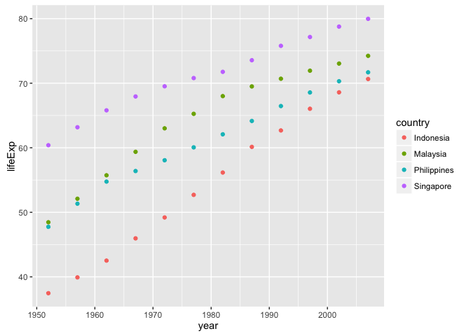
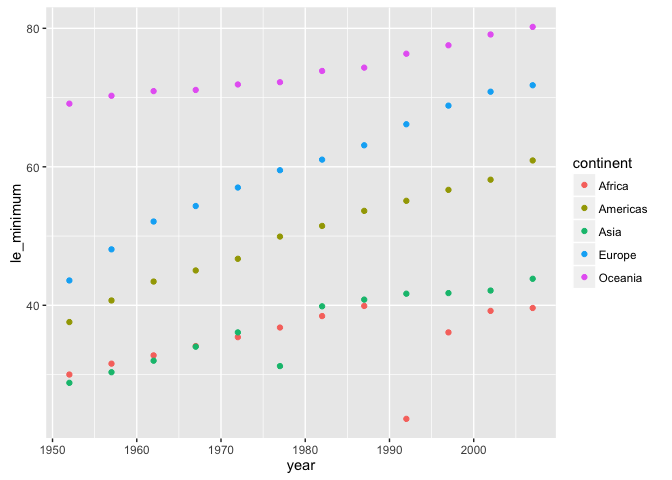

HWO4
================

``` r
library(gapminder)
library(tidyverse)
```

    ## Warning: package 'tidyverse' was built under R version 3.3.2

    ## Loading tidyverse: ggplot2
    ## Loading tidyverse: tibble
    ## Loading tidyverse: tidyr
    ## Loading tidyverse: readr
    ## Loading tidyverse: purrr
    ## Loading tidyverse: dplyr

    ## Warning: package 'tibble' was built under R version 3.3.2

    ## Warning: package 'tidyr' was built under R version 3.3.2

    ## Warning: package 'readr' was built under R version 3.3.2

    ## Warning: package 'purrr' was built under R version 3.3.2

    ## Warning: package 'dplyr' was built under R version 3.3.2

    ## Conflicts with tidy packages ----------------------------------------------

    ## filter(): dplyr, stats
    ## lag():    dplyr, stats

``` r
library(tidyr)
library(reshape2)
```

    ## 
    ## Attaching package: 'reshape2'

    ## The following object is masked from 'package:tidyr':
    ## 
    ##     smiths

Data Reshaping Prompt
=====================

Activity \# 2
-------------

-   Make a tibble with one row per year and columns for life expectancy for two or more countries.
-   Use knitr::kable() to make this table look pretty in your rendered homework.
-   Take advantage of this new data shape to scatterplot life expectancy for one country against that of another.

``` r
comparative_sea <- gapminder %>% 
  filter(country %in% c("Indonesia","Malaysia","Singapore", "Philippines")) %>% 
  select(year, country, lifeExp)
```

    ## Warning: package 'bindrcpp' was built under R version 3.3.2

``` r
maritime_le <- comparative_sea %>%
  spread(key = country, value = lifeExp)
knitr::kable(maritime_le)
```

|  year|  Indonesia|  Malaysia|  Philippines|  Singapore|
|-----:|----------:|---------:|------------:|----------:|
|  1952|     37.468|    48.463|       47.752|     60.396|
|  1957|     39.918|    52.102|       51.334|     63.179|
|  1962|     42.518|    55.737|       54.757|     65.798|
|  1967|     45.964|    59.371|       56.393|     67.946|
|  1972|     49.203|    63.010|       58.065|     69.521|
|  1977|     52.702|    65.256|       60.060|     70.795|
|  1982|     56.159|    68.000|       62.082|     71.760|
|  1987|     60.137|    69.500|       64.151|     73.560|
|  1992|     62.681|    70.693|       66.458|     75.788|
|  1997|     66.041|    71.938|       68.564|     77.158|
|  2002|     68.588|    73.044|       70.303|     78.770|
|  2007|     70.650|    74.241|       71.688|     79.972|

``` r
sea_plot1 <- ggplot(comparative_sea, aes(x=year, y=lifeExp, color=country)) + geom_point ()
sea_plot1
```



``` r
minimum_lifeExp <- gapminder %>% 
  group_by(year,continent) %>% 
  summarize(le_minimum = min(lifeExp))
cont_min <- minimum_lifeExp %>%
  spread(key=continent, value=le_minimum)
knitr::kable(cont_min)
```

|  year|  Africa|  Americas|    Asia|  Europe|  Oceania|
|-----:|-------:|---------:|-------:|-------:|--------:|
|  1952|  30.000|    37.579|  28.801|  43.585|   69.120|
|  1957|  31.570|    40.696|  30.332|  48.079|   70.260|
|  1962|  32.767|    43.428|  31.997|  52.098|   70.930|
|  1967|  34.113|    45.032|  34.020|  54.336|   71.100|
|  1972|  35.400|    46.714|  36.088|  57.005|   71.890|
|  1977|  36.788|    49.923|  31.220|  59.507|   72.220|
|  1982|  38.445|    51.461|  39.854|  61.036|   73.840|
|  1987|  39.906|    53.636|  40.822|  63.108|   74.320|
|  1992|  23.599|    55.089|  41.674|  66.146|   76.330|
|  1997|  36.087|    56.671|  41.763|  68.835|   77.550|
|  2002|  39.193|    58.137|  42.129|  70.845|   79.110|
|  2007|  39.613|    60.916|  43.828|  71.777|   80.204|

``` r
cont_plot <- ggplot(minimum_lifeExp, aes(year, le_minimum, colour=continent)) + geom_point()
cont_plot
```


